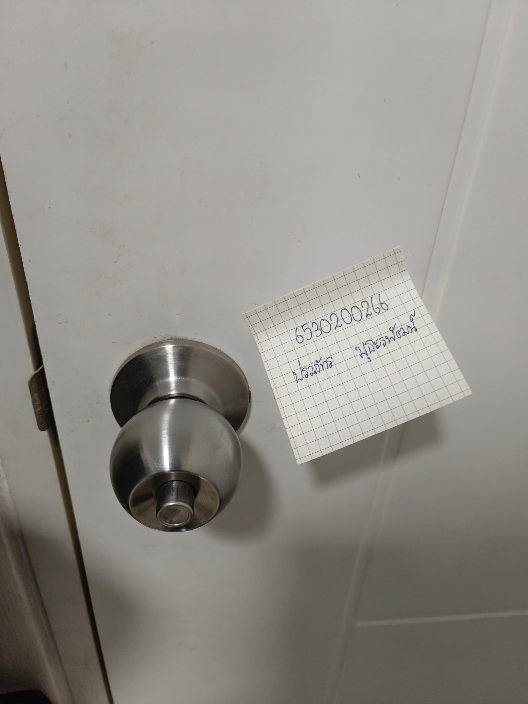

# 🔐 Security Control

---

**🔑 ลูกบิดล็อคประตู**
- สถานที่:
- Control Function: Preventative
- Type of Security Control: Physical Control 

**ทำไมถึงเรียกว่าการควบคุมทางกายภาพ?**
- สัมผัสได้: ลูกบิดล็อคประตูเป็นวัตถุที่จับต้องได้ สามารถมองเห็นและสัมผัสได้
- ป้องกันทางกายภาพ: ทำหน้าที่เป็นอุปสรรคทางกายภาพเพื่อขัดขวางการเข้าถึงโดยไม่ได้รับอนุญาต

**ฟังก์ชันหลักของลูกบิดล็อคประตู**
- ป้องกันการบุกรุก: ป้องกันไม่ให้คนที่ไม่รู้จักเข้ามาในพื้นที่ที่ต้องการความปลอดภัย เช่น บ้าน
- รักษาความเป็นส่วนตัว: ช่วยให้เราสามารถควบคุมการเข้าถึงพื้นที่ส่วนตัวได้
- ป้องกันการเกิดทรัพย์สินสูญหาย: ลดความเสี่ยงในการสูญเสียทรัพย์สินจากการโจรกรรม

---

# 🖼️
 

---

**📃 สรุป**
- ลูกบิดล็อคประตูเป็นเพียงส่วนหนึ่งของระบบรักษาความปลอดภัยที่ครอบคลุม การใช้ลูกบิดล็อคประตูร่วมกับการควบคุมทางกายภาพอื่นๆ จะช่วยเพิ่มความปลอดภัยให้กับบ้านหรือสถานที่ของเรา
